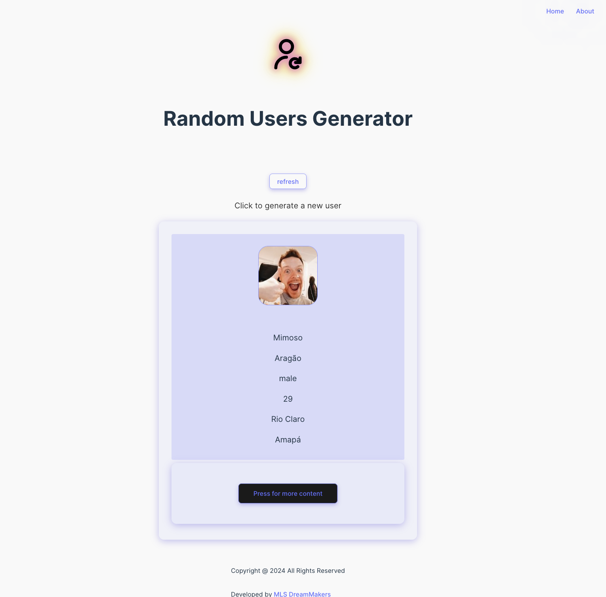
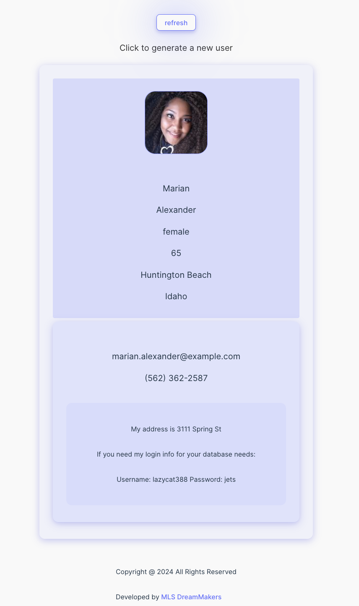
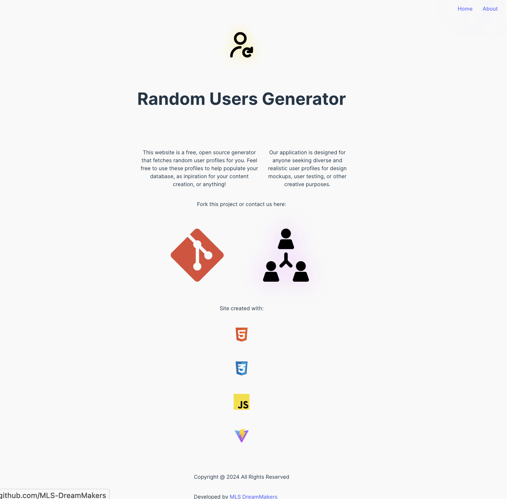
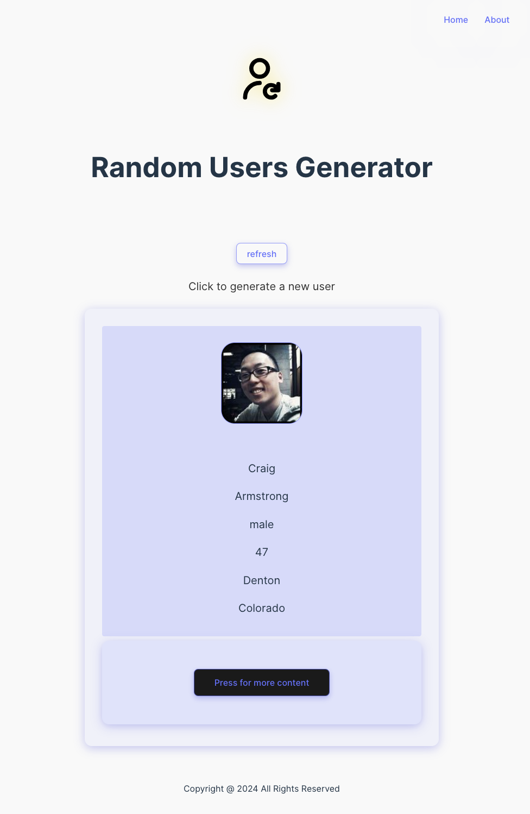

# Random Users App
Random Users Generator is a SPA (single-page application) that fetches from an API and renders random user profiles.

## Table of Contents

* [Documentation](#documentation)
* [Technologies](#technologies)
* [Screenshots](#screenshots)
* [Acknowledgements](#acknowledgements)
* [Team](#team)
* [Feedback](#feedback)

## Documentation

[Project Requirements](https://github.com/MLS-DreamMakers/.github) | [Project Proposal](https://docs.google.com/document/d/1ndnrKH8Q5RyNzDFa5nhL4MI2r0jszhzmeS1Ap3S-oHE/edit) | [Organization](https://github.com/MLS-DreamMakers)

Demo Video(TBA) | [Presentation Slides](https://docs.google.com/presentation/d/1AapP4u8urv2PVKc1s18LckHiI24dmQkyC1DyqUNqEhc/edit?usp=sharing)

[Repository](https://github.com/MLS-DreamMakers/random-users-app) | [Scrum Board](https://github.com/orgs/MLS-DreamMakers/projects/1)

[Deployment Link](https://mls-dreammakers.github.io/about)

## Technologies

Vanilla JS, HTML5, CSS3, Vite, NodeJS, Git, VSCode, GitHub Pages

## Screenshots

### Landing Page

### Dropdown Feature

### About Page

### Mobile Support

## Acknowledgements

* [MLS S24 Curriculum](https://github.com/The-Marcy-Lab-School/2024-Spring-Curriculum-Nirvana)

* [Random User API](https://randomuser.me/)

## Team

*☆ MLS-MOD4 API project by S24 Nirvana's DreamMakers team  ☆*

| Roles             |                  |
| ------- | ------------------------------- |
| [Jahmari](https://github.com/jahmarimaxwell)  | Software Engineer               |
| [Eileen](https://github.com/eileectrxity)  | Software Engineer, Scrum Master |
| Gonzalo | Engineering Manager             |
| Kristen | Engineering Manager             |

## Feedback

If you have any feedback, please reach out ☺